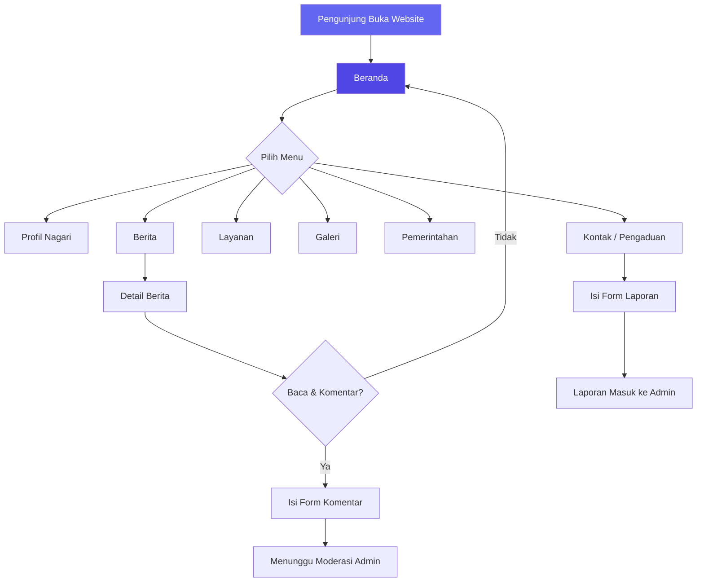
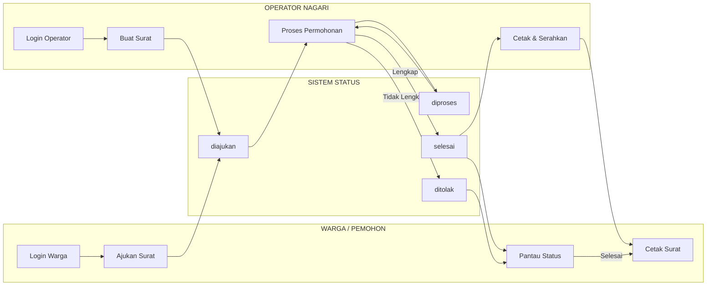
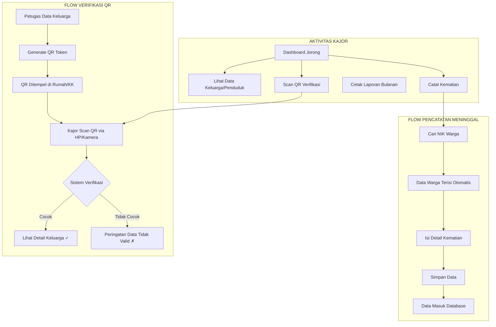
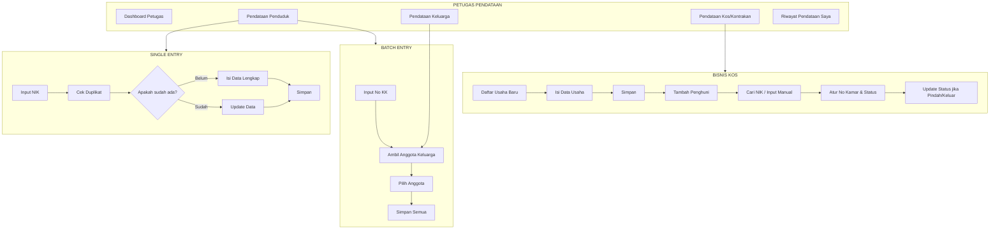
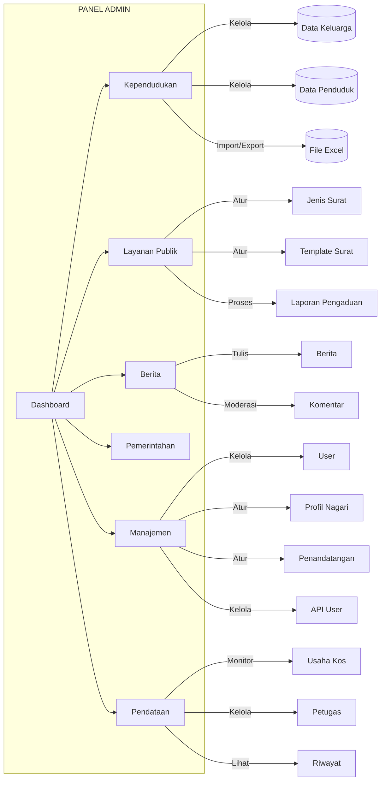

# Panduan Alur Aplikasi

## Sistem Informasi Layanan Administrasi Kependudukan (SIYanDuk) — Nagari Kuamangalai

---

**Daftar Aplikasi:**
1. Portal Kuamangalai — Website Publik
2. Si Yanduk — Aplikasi Pelayanan Publik (Operator)
3. Aplikasi Pencatatan Meninggal (Kajor)
4. Aplikasi Pendataan Terpadu (Petugas)
5. Panel Admin — Manajemen Sistem

---

# 1. Portal Kuamangalai (Website Publik)

### Deskripsi
Portal informasi publik Nagari Kuamangalai yang dapat diakses oleh siapa saja tanpa login. Menampilkan profil nagari, berita, layanan, galeri, dan informasi publik lainnya.

### Aktor
- **Publik/Pengunjung** — Tidak perlu login
- **Admin** — Mengelola konten dari belakang

### Prasyarat
- Koneksi internet
- Browser web

---

### Alur Pengunjung

```
                        PORTAL KUAMANGALAI
                              │
                              ▼
                    ┌─────────────────────┐
                    │      BERANDA        │
                    │  - Hero/Header      │
                    │  - Statistik Nagari │
                    │  - Berita Terbaru   │
                    │  - Navigasi Menu    │
                    └────────┬────────────┘
                             │
              ┌──────────────┼──────────────┐
              │              │              │
              ▼              ▼              ▼
    ┌─────────────┐ ┌──────────────┐ ┌──────────────┐
    │   PROFIL    │ │   BERITA     │ │   LAYANAN    │
    │  Nagari     │ │ List Berita  │ │ Info Layanan │
    │  Tentang    │ │ Detail       │ │ Publik       │
    └─────────────┘ │ + Komentar   │ └──────────────┘
                    └──────────────┘
              │              │              │
              ▼              ▼              ▼
    ┌─────────────┐ ┌──────────────┐ ┌──────────────┐
    │   GALERI    │ │ PEMERINTAHAN │ │   KONTAK     │
    │ Foto Berita │ │ Struktur     │ │ Form Pengaduan│
    │             │ │ Perangkat    │ │ Info Kontak  │
    └─────────────┘ └──────────────┘ └──────────────┘
```

### Langkah Detail

#### A. Menjelajahi Website
| Langkah | Tindakan | Hasil |
|---------|----------|-------|
| 1 | Buka URL website | Tampil halaman beranda dengan hero, statistik, dan berita terbaru |
| 2 | Klik menu **Profil** | Lihat profil nagari, sejarah, visi-misi |
| 3 | Klik menu **Berita** | Lihat daftar berita, klik untuk baca detail |
| 4 | Scroll ke bawah | Lihat informasi footer (kontak, alamat, sosial media) |

#### B. Membaca & Berinteraksi dengan Berita
| Langkah | Tindakan | Hasil |
|---------|----------|-------|
| 1 | Klik **Berita** di navbar | Tampil daftar semua berita |
| 2 | Klik judul berita | Halaman detail berita (isi, gambar, penulis, tanggal) |
| 3 | Isi form komentar (nama + isi) | Komentar masuk, menunggu moderasi admin |
| 4 | Lihat komentar yang sudah disetujui | Komentar muncul di bagian bawah berita |

#### C. Mengirim Pengaduan/Laporan
| Langkah | Tindakan | Hasil |
|---------|----------|-------|
| 1 | Klik menu **Kontak** | Tampil form kontak dan informasi alamat |
| 2 | Isi nama, email, kategori, pesan | Data terkirim ke sistem |
| 3 | Klik **Kirim** | Admin akan menerima dan memproses laporan |

---

### Diagram Mermaid



---

# 2. Si Yanduk (Aplikasi Pelayanan Publik — Operator)

### Deskripsi
**Si Yanduk** (Sistem Informasi Pelayanan Kependudukan) adalah aplikasi untuk pengelolaan layanan administrasi kependudukan oleh **Operator** Nagari. Meliputi pembuatan surat, pengelolaan data penduduk & keluarga, serta pemrosesan permohonan dari warga.

### Aktor
- **Operator** — Pegawai kantor nagari yang melayani pembuatan surat
- **Warga** — Masyarakat yang mengajukan permohonan surat

### Prasyarat
- Akun dengan role **Operator** atau **Warga**
- Login ke sistem

---

### Alur Layanan Surat (End-to-End)

```
WARGA (Langsung ke Kantor)                 WARGA (Online)
         │                                       │
         │                                       │
         ▼                                       ▼
┌─────────────────────┐           ┌─────────────────────────┐
│ Warga datang ke     │           │ Warga login →           │
│ kantor nagari       │           │ Ajukan surat online     │
└─────────┬───────────┘           └───────────┬─────────────┘
          │                                   │
          ▼                                   ▼
┌─────────────────────────────────────────────────────────┐
│              SURAT DIAJUKAN (status: diajukan)            │
│         Masuk ke daftar permohonan Operator              │
└─────────────────────────┬───────────────────────────────┘
                          │
                          ▼
┌─────────────────────────────────────────────────────────┐
│            OPERATOR PROSES PERMOHONAN                    │
│  • Buka menu Proses Permohonan                          │
│  • Lihat daftar surat masuk                             │
│  • Periksa kelengkapan data pemohon                    │
└─────────────────────────┬───────────────────────────────┘
                          │
                          ▼
            ┌─────────────────────────┐
            │    DIPROSES             │
            │  (status: diproses)     │
            └────────┬────────────────┘
                     │
          ┌──────────┴──────────┐
          ▼                     ▼
┌──────────────────┐  ┌──────────────────┐
│    SELESAI       │  │    DITOLAK       │
│ (status: selesai)│  │ (status: ditolak)│
│ Cetak Surat      │  │ Beri alasan      │
│ Serahkan ke      │  │ penolakan        │
│ pemohon          │  │                  │
└──────────────────┘  └──────────────────┘
          │
          ▼
┌─────────────────────────────────────────┐
│           RIWAYAT PERMOHONAN             │
│  Semua surat selesai/ditolak tercatat   │
│  Bisa dicari berdasarkan NIK/nama       │
└─────────────────────────────────────────┘
```

### Langkah Detail

#### A. Untuk Operator (Proses Surat)

| Langkah | Tindakan | Hasil |
|---------|----------|-------|
| 1 | Login dengan akun Operator | Masuk ke dashboard Operator |
| 2 | Klik menu **Layanan Publik > Buat Surat** | Lihat daftar jenis surat yang tersedia |
| 3 | Pilih jenis surat (misal: SK Domisili) | Tampil form pembuatan surat |
| 4 | Masukkan NIK pemohon (otomatis cari data) | Data pemohon terisi otomatis |
| 5 | Pilih **Penandatangan**, isi keterangan | Form lengkap |
| 6 | Klik **Simpan** | Surat tersimpan dengan status **diajukan** |
| 7 | Buka menu **Proses Permohonan** | Lihat semua surat yang perlu diproses |
| 8 | Klik **Proses** pada surat yang dipilih | Status berubah menjadi **diproses** |
| 9 | Setelah selesai, klik **Selesai** | Status menjadi **selesai** (tanggal selesai tercatat) |
| 10 | Klik **Cetak** | Buka halaman cetak surat |
| 11 | Cetak/Download PDF | Surat siap diserahkan ke pemohon |

#### B. Untuk Warga (Ajukan Surat Online)

| Langkah | Tindakan | Hasil |
|---------|----------|-------|
| 1 | Login dengan akun Warga | Masuk ke dashboard Warga |
| 2 | Klik **Layanan Publik > Buat Surat** | Lihat daftar jenis surat |
| 3 | Pilih jenis surat | Isi form permohonan |
| 4 | Masukkan data yang diminta, klik **Ajukan** | Surat terkirim dengan status **diajukan** |
| 5 | Buka menu **Proses Permohonan** | Pantau status surat (diajukan → diproses → selesai/ditolak) |
| 6 | Jika status **selesai** | Klik **Cetak** untuk download PDF surat |

#### C. Mengelola Data Penduduk & Keluarga (Operator)

| Langkah | Tindakan | Hasil |
|---------|----------|-------|
| 1 | Klik menu **Kependudukan > Data Keluarga** | Lihat, tambah, edit data keluarga |
| 2 | Klik menu **Kependudukan > Data Penduduk** | Lihat, tambah, edit data penduduk |
| 3 | Gunakan fitur **Cari NIK** / **Cari KK** | Pencarian cepat data warga |

---

### Diagram Mermaid



---

# 3. Aplikasi Pencatatan Meninggal (Kepala Jorong / Kajor)

### Deskripsi
Aplikasi untuk **Kepala Jorong (Kajor)** dalam mencatat dan melaporkan data kematian warga di wilayah jorongnya. Dilengkapi dengan verifikasi QR code untuk memvalidasi data pendataan keluarga yang dilakukan oleh Petugas.

### Aktor
- **Kajor** — Kepala Jorong (mencatat kematian, verifikasi QR)
- **Petugas** — Melakukan pendataan keluarga (menghasilkan QR)
- **Admin** — Melihat semua data lintas jorong

### Prasyarat
- Akun dengan role **Kajor**
- Terdaftar pada jorong tertentu

---

### Alur Pencatatan Meninggal

```
                    KEPALA JORONG (KAJOR)
                           │
                           ▼
              ┌─────────────────────────┐
              │       DASHBOARD         │
              │  • Statistik Jorong     │
              │  • Grafik Penduduk      │
              │  • Info Keluarga        │
              └───────────┬─────────────┘
                          │
          ┌───────────────┼───────────────┐
          │               │               │
          ▼               ▼               ▼
  ┌──────────────┐ ┌──────────────┐ ┌──────────────┐
  │  DATA        │ │  DATA        │ │  USAHA KOS   │
  │  KELUARGA    │ │  PENDUDUK    │ │  & KONTRAKAN │
  │  (Lihat)     │ │  (Lihat)     │ │  (Lihat)     │
  └──────────────┘ └──────┬───────┘ └──────────────┘
                          │
                          ▼
              ┌─────────────────────────┐
              │   CATAT MENINGGAL       │
              │  • Cari NIK warga       │
              │  • Data otomatis terisi │
              │  • Isi tgl, penyebab    │
              │  • Simpan               │
              └───────────┬─────────────┘
                          │
                          ▼
              ┌─────────────────────────┐
              │  DATA MENINGGAL         │
              │  • Lihat semua catatan  │
              │  • Edit jika perlu      │
              │  • Hapus jika salah     │
              └───────────┬─────────────┘
                          │
                          ▼
              ┌─────────────────────────┐
              │  LAPORAN BULANAN        │
              │  • Pilih bulan & tahun  │
              │  • Total kematian       │
              │  • Rincian L/P          │
              │  • Cetak PDF            │
              └─────────────────────────┘
```

### Alur Verifikasi QR Code

```
PETUGAS                           KAUR
  │                                │
  │ 1. Data Keluarga               │
  │ 2. Generate QR Token           │
  │ 3. Tempelkan QR di             │
  │    rumah/KK ybs                │
  │                                │
  │                                │
  │          QR CODE               │
  │◄═══════════════════════►       │
  │                                │
  │                   4. Scan QR via Scanner
  │                   5. Verifikasi data cocok?
  │                   6. Lihat detail keluarga
  │                                │
  ▼                                ▼
```

### Langkah Detail

#### A. Mencatat Data Kematian

| Langkah | Tindakan | Hasil |
|---------|----------|-------|
| 1 | Login akun Kajor | Dashboard jorong dengan statistik |
| 2 | Klik menu **Kependudukan > Data Meninggal** | Lihat daftar catatan kematian yang ada |
| 3 | Klik **Tambah Data** | Form pencatatan baru |
| 4 | Masukkan NIK warga yang meninggal | Data warga (nama, JK, tgl lahir) terisi otomatis |
| 5 | Isi data kematian: tgl, waktu, tempat, penyebab, saksi | Form lengkap |
| 6 | Klik **Simpan** | Data tersimpan, masuk ke daftar |
| 7 | (Opsional) Klik **Edit** jika ada perbaikan | Ubah data yang salah |
| 8 | (Opsional) Klik **Hapus** jika tidak valid | Data dihapus |

#### B. Membuat Laporan Bulanan

| Langkah | Tindakan | Hasil |
|---------|----------|-------|
| 1 | Klik menu **Laporan Meninggal** | Tampil form filter bulan/tahun |
| 2 | Pilih bulan dan tahun | Tampil rekap: total meninggal, jumlah L/P |
| 3 | Klik **Cetak** | Laporan PDF siap dicetak/didownload |

#### C. Verifikasi QR Code (Pendataan Keluarga)

| Langkah | Tindakan | Hasil |
|---------|----------|-------|
| 1 | Klik menu **Scan QR Code** | Tampil halaman scanner |
| 2 | Arahkan kamera ke QR Code | Sistem membaca token QR |
| 3 | Sistem verifikasi kecocokan data | Jika cocok: redirect ke detail keluarga |
| 4 | Lihat data keluarga | Data valid dan terverifikasi |

---

### Diagram Mermaid



---

# 4. Aplikasi Pendataan Terpadu (Petugas)

### Deskripsi
Aplikasi untuk **Petugas Pendataan** dalam melakukan pendataan lapangan, mencakup:
1. **Pendataan Penduduk** — Data individu warga (single & batch via KK)
2. **Pendataan Keluarga (KK)** — Registrasi & update Kartu Keluarga dengan audit trail
3. **Pendataan Kos/Kontrakan** — Data usaha kos, kontrakan, rumah petak + penghuni

### Aktor
- **Petugas** — Petugas lapangan yang melakukan pendataan
- **Kajor** — Melihat hasil pendataan di jorongnya
- **Admin** — Memonitor aktivitas petugas

### Prasyarat
- Akun dengan role **Petugas**
- Akses ke data lapangan

---

### Alur Pendataan Penduduk

```
                    PETUGAS LOGIN
                         │
                         ▼
              ┌─────────────────────────┐
              │       DASHBOARD         │
              │  Statistik Pendataan    │
              └───────────┬─────────────┘
                          │
          ┌───────────────┼───────────────┐
          ▼               ▼               ▼
┌─────────────────┐ ┌─────────────────┐ ┌─────────────────┐
│ PENDATAAN       │ │ PENDATAAN       │ │ BISNIS KOS      │
│ PENDUDUK        │ │ KELUARGA (KK)   │ │ & KONTRAKAN     │
└────────┬────────┘ └────────┬────────┘ └────────┬────────┘
         │                   │                   │
         ▼                   ▼                   ▼
┌──────────────────┐ ┌──────────────────┐ ┌──────────────────┐
│ Single Entry     │ │ Entry Baru KK   │ │ Daftar Usaha     │
│ • Input NIK      │ │ • Input No KK   │ │ • Jenis Usaha    │
│ • Cek Duplikat   │ │ • Data Kepala   │ │ • Data Pemilik   │
│ • Isi Data       │ │   Keluarga      │ │ • Alamat & Kamar │
│ • Simpan         │ │ • Anggota       │ │ • Status Aktif   │
└──────────────────┘ │   Keluarga      │ └────────┬─────────┘
         │           │ • Simpan        │          │
         ▼           └────────┬────────┘          ▼
┌──────────────────┐         │           ┌──────────────────┐
│ Batch Entry      │         ▼           │ Tambah Penghuni  │
│ • Input No KK    │ ┌──────────────────┐│ • Cari NIK       │
│ • Ambil Data     │ │ AUDIT TRAIL      ││ • No Kamar       │
│   Anggota dari   │ │ Riwayat lengkap  ││ • Tgl Masuk      │
│   Database       │ │ + QR Token       ││ • Status (aktif/  │
│ • Submit Semua   │ │ + Data Sebelum   ││   pindah/keluar) │
└──────────────────┘ │ + Data Sesudah   │└────────┬─────────┘
                     └──────────────────┘         │
                                                  ▼
                                         ┌──────────────────┐
                                         │ Update Status    │
                                         │ • Aktif → Pindah │
                                         │ • Aktif → Keluar │
                                         └──────────────────┘
```

### Langkah Detail

#### A. Pendataan Penduduk (Single Entry)

| Langkah | Tindakan | Hasil |
|---------|----------|-------|
| 1 | Login akun Petugas | Dashboard Petugas |
| 2 | Buka menu **Pendataan > Pendataan Penduduk** | Form input data |
| 3 | Masukkan NIK warga | Sistem cek duplikat otomatis |
| 4 | Jika NIK baru: isi semua data (nama, TTL, JK, agama, dll) | Data lengkap |
| 5 | Klik **Simpan** | Data tersimpan di **PendataanPenduduk** (pending) & **Penduduk** |

#### B. Pendataan Penduduk (Batch Entry via KK)

| Langkah | Tindakan | Hasil |
|---------|----------|-------|
| 1 | Buka menu **Pendataan > Pendataan Penduduk** | Form input |
| 2 | Masukkan **No KK** | Sistem cari data KK dan anggota keluarga |
| 3 | Centang anggota yang akan didata | Terpilih semua anggota |
| 4 | Klik **Simpan Semua** | Data semua anggota tersimpan sekaligus |
| 5 | Sistem tampilkan ringkasan: X data tersimpan, Y data sudah ada | Konfirmasi hasil |

#### C. Pendataan Kartu Keluarga (KK)

| Langkah | Tindakan | Hasil |
|---------|----------|-------|
| 1 | Buka menu **Pendataan > Pendataan Kartu Keluarga** | Daftar keluarga yang sudah didata |
| 2 | Klik **Tambah Baru** | Form data KK |
| 3 | Masukkan No KK (16 digit), alamat, jorong, dll | Data keluarga |
| 4 | Masukkan NIK Kepala Keluarga | Nama Kepala Keluarga terisi otomatis |
| 5 | Klik **Simpan** | Data tersimpan + Riwayat dengan QR Token tergenerate |
| 6 | (Edit) Klik **Edit** untuk update data | Riwayat perubahan terekam (data_sebelum → data_sesudah) |

#### D. Pendataan Kos/Kontrakan

| Langkah | Tindakan | Hasil |
|---------|----------|-------|
| 1 | Buka menu **Pendataan > Pendataan Kontrakan/Kos** | Daftar usaha yang sudah terdaftar |
| 2 | Klik **Tambah Baru** | Form data usaha |
| 3 | Pilih **Jenis Usaha**: Kos / Kontrakan / Rumah Petak | - |
| 4 | Isi nama usaha, pemilik, alamat, jorong, jumlah kamar | Data lengkap |
| 5 | Klik **Simpan** | Usaha terdaftar |
| 6 | Klik **Lihat** pada usaha → **Tambah Penghuni** | Form penghuni |
| 7 | Masukkan NIK penghuni (data otomatis dari database) atau isi manual | Data penghuni |
| 8 | Isi no kamar, tgl masuk, status | Penghuni tercatat |
| 9 | (Update) Ubah status penghuni jadi **pindah/keluar** jika diperlukan | Riwayat penghuni |

#### E. Melihat Riwayat Pendataan

| Langkah | Tindakan | Hasil |
|---------|----------|-------|
| 1 | Klik menu **Pendataan > Riwayat Saya** | Lihat semua aktivitas pendataan yang saya lakukan |
| 2 | Filter berdasarkan tanggal | Riwayat sesuai periode |
| 3 | Klik **Detail** pada salah satu riwayat | Lihat data sebelum & sesudah perubahan |

---

### Diagram Mermaid



---

# 5. Panel Admin (Manajemen Sistem)

### Deskripsi
Panel administrasi untuk mengelola seluruh aspek sistem, termasuk master data kependudukan, layanan surat, konten website, pengguna, dan monitoring aktivitas petugas.

### Aktor
- **Admin** — Pengelola utama sistem

### Prasyarat
- Akun dengan role **Admin**

---

### Alur Admin

```
                    ADMIN LOGIN
                         │
                         ▼
              ┌─────────────────────────┐
              │       DASHBOARD         │
              │  Statistik menyeluruh   │
              └───────────┬─────────────┘
                          │
         ┌────────────────┼────────────────┐
         ▼                ▼                ▼
┌─────────────────┐ ┌─────────────────┐ ┌─────────────────┐
│  KEPENDUDUKAN   │ │ LAYANAN PUBLIK  │ │     BERITA      │
│ • Data Keluarga │ │ • Jenis Surat   │ │ • Daftar Berita │
│ • Data Penduduk │ │ • Template Surat│ │ • Kategori      │
│ • Import/Export │ │ • Laporan Masuk │ │ • Komentar      │
│ • Riwayat       │ │ • Penandatangan │ │   Moderasi      │
│   Pendataan     │ │                 │ │                 │
└─────────────────┘ └─────────────────┘ └─────────────────┘
         │                │                     │
         ▼                ▼                     ▼
┌─────────────────┐ ┌─────────────────┐ ┌─────────────────┐
│  PEMERINTAHAN   │ │   MANAJEMEN     │ │   PENDATAAN     │
│ • Jabatan       │ │ • User          │ │ • Usaha Kos     │
│ • Perangkat     │ │   Management    │ │ • Petugas       │
│   Nagari        │ │ • Profil Nagari │ │   Pendataan     │
│                 │ │ • Tentang       │ │ • Riwayat       │
│                 │ │ • Profil Admin  │ │   Pendataan     │
│                 │ │ • API User      │ │                 │
└─────────────────┘ └─────────────────┘ └─────────────────┘
```

### Langkah Detail

#### A. Kelola Kependudukan

| Langkah | Tindakan | Hasil |
|---------|----------|-------|
| 1 | Klik menu **Kependudukan > Data Keluarga** | CRUD data Kartu Keluarga |
| 2 | Klik menu **Kependudukan > Data Penduduk** | CRUD data penduduk |
| 3 | Klik **Cari KK** untuk lihat anggota keluarga | Filter data per KK |
| 4 | Klik **Import Data** untuk upload Excel | Import massal data penduduk/keluarga |
| 5 | Klik **Riwayat Pendataan Keluarga** | Monitoring aktivitas petugas pendataan |

#### B. Kelola Layanan Surat

| Langkah | Tindakan | Hasil |
|---------|----------|-------|
| 1 | Klik **Layanan Publik > Jenis Surat** | Atur jenis-jenis surat yang tersedia |
| 2 | Klik **Layanan Publik > Template Surat** | Atur format/template surat (kop, isi, tanda tangan) |
| 3 | Klik **Layanan Publik > Laporan** | Lihat laporan pengaduan dari warga |
| 4 | Update status laporan (diproses/selesai) | Tindak lanjut pengaduan |

#### C. Kelola Berita & Konten Website

| Langkah | Tindakan | Hasil |
|---------|----------|-------|
| 1 | Klik **Berita > Kategori Berita** | Buat/atur kategori berita |
| 2 | Klik **Berita > Daftar Berita** | Buat, edit, hapus berita |
| 3 | Klik **Berita > Komentar** | Moderasi komentar: setujui/tolak/hapus |
| 4 | Klik **Pemerintahan > Perangkat Nagari** | Atur struktur pemerintahan |
| 5 | Klik **Manajemen > Profil Nagari** | Update profil & pengaturan nagari |

#### D. Kelola Pengguna & Keamanan

| Langkah | Tindakan | Hasil |
|---------|----------|-------|
| 1 | Klik **Manajemen > User Management** | Tambah/edit/hapus user sistem |
| 2 | Atur role user (admin/operator/petugas/warga/kajor) | Kontrol akses |
| 3 | Klik **Manajemen > API User** | Kelola API key untuk integrasi eksternal |
| 4 | Klik **Manajemen > Penandatangan** | Atur pejabat penandatangan surat |

#### E. Monitoring Pendataan

| Langkah | Tindakan | Hasil |
|---------|----------|-------|
| 1 | Klik **Pendataan > Usaha Kos & Kontrakan** | Lihat semua data usaha dari petugas |
| 2 | Klik **Pendataan > Petugas Pendataan** | Kelola akun petugas & status aktif |
| 3 | Klik **Pendataan > Riwayat Pendataan** | Monitor aktivitas semua petugas |

---

### Diagram Mermaid



---

# Lampiran: Peta Navigasi Per Role

```
                                ┌─────────────────────────────────────────────────────────────┐
                                │                      SISTEM MASUK                          │
                                │              Login → Dashboard Sesuai Role                  │
                                └─────────────────────────────────────────────────────────────┘
                                                    │
          ┌───────────────────┬──────────────────────┼──────────────────────┬───────────────────┐
          ▼                   ▼                      ▼                      ▼                   ▼
┌──────────────────┐ ┌──────────────────┐ ┌──────────────────┐ ┌──────────────────┐ ┌──────────────────┐
│     PUBLIK       │ │     WARGA        │ │    OPERATOR      │ │    PETUGAS       │ │     KAJOR        │
│   (Tidak Login)  │ │   (Login)        │ │   (Login)        │ │   (Login)        │ │   (Login)        │
├──────────────────┤ ├──────────────────┤ ├──────────────────┤ ├──────────────────┤ ├──────────────────┤
│ • Beranda        │ │ • Dashboard      │ │ • Dashboard      │ │ • Dashboard      │ │ • Dashboard      │
│ • Profil         │ │ • Buat Surat     │ │ • Buat Surat     │ │ • Pendataan      │ │ • Data Keluarga  │
│ • Berita         │ │ • Proses Surat   │ │ • Proses Surat   │ │   Penduduk       │ │ • Data Penduduk  │
│   + Detail       │ │ • Riwayat Surat  │ │ • Riwayat Surat  │ │ • Pendataan KK   │ │ • Data Meninggal │
│   + Komentar     │ │ • Cetak Surat    │ │ • Cetak Surat    │ │ • Pendataan      │ │ • Laporan        │
│ • Layanan        │ │ • Profil Saya    │ │ • Data Penduduk  │ │   Kos/Kontrakan  │ │   Meninggal      │
│ • Galeri         │ │                  │ │ • Data Keluarga  │ │ • Riwayat Saya   │ │ • Usaha Kos      │
│ • Pemerintahan   │ │                  │ │ • Cari NIK/KK    │ │ • Cari NIK/KK    │ │ • Scan QR        │
│ • Kontak         │ │                  │ │ • Profil Saya    │ │ • Profil Saya    │ │ • Cari NIK/KK    │
│   + Pengaduan    │ │                  │ │                  │ │                  │ │ • Profil Saya    │
└──────────────────┘ └──────────────────┘ └──────────────────┘ └──────────────────┘ └──────────────────┘
```

---

**Catatan:**
- Semua diagram menggunakan format Mermaid. Untuk melihat diagram, gunakan editor yang mendukung Mermaid (seperti GitHub, GitLab, atau VS Code dengan plugin Mermaid).
- Alur di atas dapat berubah sesuai dengan pengembangan fitur terbaru.
- Untuk pertanyaan atau saran, hubungi Admin Nagari.

---

*Dokumen ini digenerate pada: 26 Mei 2026*
*SIYanDuk App — Nagari Kuamangalai*
