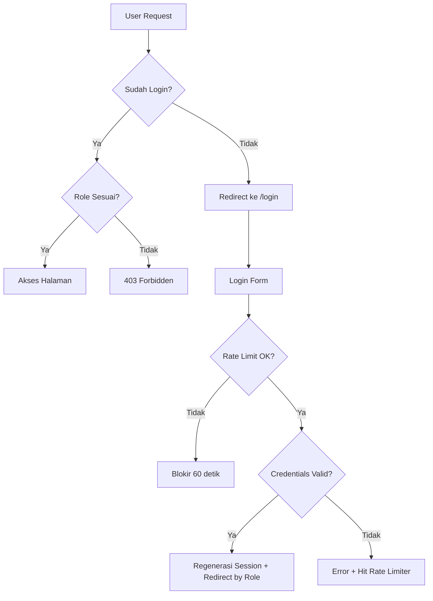

# 🔒 Implementasi Sistem Autentikasi SIYanDuk

## Arsitektur Keamanan

## File yang Dibuat/Diubah

| File | Status | Keterangan |
|------|--------|------------|
| `app/Models/User.php` | ✏️ Diubah | Tambah fillable: username, role, nik + helper methods |
| `app/Http/Controllers/AuthController.php` | ✏️ Diubah | Login, logout, register, cekNik (AJAX) |
| `app/Http/Middleware/RoleMiddleware.php` | 🆕 Baru | Middleware proteksi role-based access |
| `bootstrap/app.php` | ✏️ Diubah | Register middleware alias `role` |
| `routes/web.php` | ✏️ Diubah | Semua route dilindungi auth+role middleware |
| `database/migrations/...users_table.php` | ✏️ Diubah | Tambah kolom `nik` |
| `database/seeders/DatabaseSeeder.php` | ✏️ Diubah | 4 user default (admin, operator, kajor, warga) |
| `resources/views/auth/login.blade.php` | 🆕 Baru | Form login dengan CSRF + validasi |
| `resources/views/auth/register.blade.php` | 🆕 Baru | Form registrasi warga + verifikasi NIK |
| `resources/views/errors/403.blade.php` | 🆕 Baru | Halaman error akses ditolak |
| `admin/layouts/sidebar.blade.php` | ✏️ Diubah | Tombol Keluar → POST form |
| `operator/layouts/sidebar.blade.php` | ✏️ Diubah | Tombol Keluar → POST form |
| `warga/layouts/sidebar.blade.php` | ✏️ Diubah | Tombol Keluar → POST form |
| `kajor/layouts/sidebar.blade.php` | ✏️ Diubah | Tombol Keluar → POST form |

## Fitur Keamanan

### 1. Rate Limiting
- **Login**: Maks 5 percobaan/menit per IP+username
- **Registrasi**: Maks 3 percobaan/2 menit per IP

### 2. Session Security
- Regenerasi session setelah login (mencegah session fixation)
- Invalidasi session + regenerasi CSRF token saat logout

### 3. CSRF Protection
- Semua form menggunakan `@csrf`
- Logout via POST (bukan GET)

### 4. Logging
- Setiap login/logout/registrasi dicatat ke log Laravel
- Percobaan akses tidak sah dicatat (IP, username, URL)

### 5. Password Security
- Password di-hash otomatis via cast `hashed` di User model
- Minimal 6 karakter

## Akun Default

| Role | Username | Password | Dashboard |
|------|----------|----------|-----------|
| Admin | `admin` | `password123` | `/administrator` |
| Operator | `operator` | `password123` | `/operator` |
| Kepala Jorong | `kajor` | `password123` | `/kepala-jorong` |
| Warga | `warga` | `password123` | `/warga` |

## Alur Registrasi Warga

1. Warga buka halaman `/register`
2. Masukkan **NIK** → klik **Cek NIK**
3. Sistem cek via AJAX ke tabel `penduduk`
4. Jika ditemukan → tampilkan nama lengkap
5. Isi username, email, password
6. Submit → akun dibuat dengan role `warga`
7. Auto-login → redirect ke dashboard warga

> [!IMPORTANT]
> Setelah deploy, **SEGERA ganti password default** untuk akun admin dan operator!
